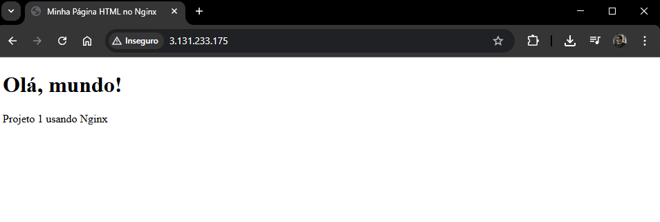
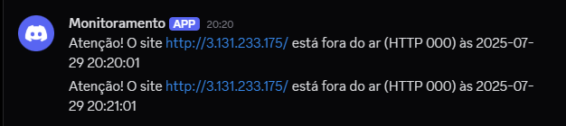
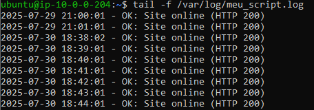

# Projeto_1_AWS

# Projeto: Monitoramento de Serviço Web com Nginx e Notificação via Discord

Este projeto implementa um sistema de monitoramento para uma instância EC2 que hospeda uma página HTML via Nginx. Ele verifica se o site está disponível a cada minuto e envia notificações via Discord em caso de indisponibilidade, além de registrar logs localmente.

---

## ✅ Etapa 1: Configurar a Instância EC2

### a. Criar a Instância EC2 na AWS

1. Acesse o console da AWS > EC2 > "Executar instância".
2. Escolha a imagem **Ubuntu Server 22.04 LTS**.
3. Escolha um tipo t2.micro (gratuito).
4. Na configuração da rede:
   - Selecione uma **sub-rede pública** (com rota para um **Internet Gateway**).
   - Ative **IP público automático**.
5. Configure o **grupo de segurança**:
   - Permitir porta **22 (SSH)** - 0.0.0.0/0
   - Permitir porta **80 (HTTP)** - 0.0.0.0/0
6. Gere ou selecione um par de chaves `.pem` e lance a instância.

> ⚠️ Para facilitar o uso contínuo, recomendamos associar um **Elastic IP** à sua instância EC2. Isso garante que o IP público não mude ao reiniciar a máquina. Veja abaixo como configurar.

---

## 🔒 Configurar Elastic IP (IP Fixo)

1. No painel EC2, clique em **Elastic IPs** no menu lateral.
2. Clique em **Allocate Elastic IP address** e confirme.
3. Após criado, clique em **Actions > Associate Elastic IP address**.
4. Escolha sua instância EC2 e associe o IP.

> Assim, você não precisa editar o script toda vez que a instância for reiniciada.

---

### b. Conectar-se via SSH

```bash
chmod 400 /caminho/para/sua-chave.pem
ssh -i /caminho/para/sua-chave.pem ubuntu@SEU_ELASTIC_IP
```

---

## ✅ Etapa 2: Instalar o Servidor Web (Nginx)

### a. Instalar o Nginx

```bash
sudo apt update
sudo apt install nginx -y
```

### b. Criar Página HTML

```bash
sudo nano /var/www/html/index.html
```

Cole o conteúdo:

```html
<!DOCTYPE html>
<html lang="pt-BR">
<head>
  <meta charset="UTF-8">
  <title>Minha Página HTML no Nginx</title>
</head>
<body>
  <h1>Olá, mundo!</h1>
  <p>Projeto 1 usando Nginx</p>
</body>
</html>
```

### c. Iniciar e Ativar o Nginx

```bash
sudo systemctl start nginx
sudo systemctl enable nginx
```

### d. Testar Acesso

Abra no navegador:

```
http://SEU_ELASTIC_IP
```



---

## ✅ Etapa 3: Criar Script de Monitoramento + Notificação Discord

### a. Criar Webhook no Discord

1. No Discord, vá até o canal desejado.
2. Clique em **Editar Canal > Integrações > Webhooks > Novo Webhook**.
3. Dê um nome (ex: `Monitoramento`) e copie a URL do webhook.

### b. Criar o Script de Monitoramento

```bash
sudo nano /usr/local/bin/monitor_site.sh
```

Substitua `SEU_ELASTIC_IP` e `URL_WEBHOOK` no exemplo abaixo:

```bash
#!/bin/bash

URL="http://SEU_ELASTIC_IP"
LOG_FILE="/var/log/meu_script.log"
DISCORD_WEBHOOK_URL="URL_WEBHOOK"
DATA=$(TZ=America/Sao_Paulo date '+%Y-%m-%d %H:%M:%S')

STATUS=$(curl -s -o /dev/null -w "%{http_code}" "$URL")

if [ "$STATUS" -ne 200 ]; then
    MENSAGEM="⚠️ Atenção! O site $URL está fora do ar (HTTP $STATUS) às $DATA"
    echo "$DATA - ERRO: $MENSAGEM" >> "$LOG_FILE"

    curl -H "Content-Type: application/json"          -X POST          -d "{"content": "$MENSAGEM"}"          "$DISCORD_WEBHOOK_URL"
else
    echo "$DATA - OK: Site online (HTTP $STATUS)" >> "$LOG_FILE"
fi
```

### c. Permitir Execução

```bash
sudo chmod +x /usr/local/bin/monitor_site.sh
```

### d. Criar Arquivo de Log

```bash
sudo touch /var/log/meu_script.log
sudo chmod 666 /var/log/meu_script.log
```

### e. Agendar com Cron

```bash
crontab -e
```

Adicione a linha:

```bash
* * * * * /usr/local/bin/monitor_site.sh
```

---

## ✅ Etapa 4: Testar o Sistema

### a. Verificar site no ar

```bash
curl http://SEU_ELASTIC_IP
```

### b. Parar o Nginx para simular erro

```bash
sudo systemctl stop nginx
```

Aguarde 1 minuto e verifique:

- O canal Discord recebe notificação de erro.
- Logs mostram: `ERRO: HTTP 000`



### c. Iniciar o Nginx novamente

```bash
sudo systemctl start nginx
```

Logs voltam a exibir: `OK: Site online (HTTP 200)`

### d. Verificar logs ao vivo

```bash
tail -f /var/log/meu_script.log
```



---

## 🕒 Ajuste de Fuso Horário

Para que a hora das notificações no Discord esteja correta (ex: Horário de Brasília), altere o fuso horário da instância:

```bash
sudo timedatectl set-timezone America/Sao_Paulo
```

Confirme com:

```bash
date
```

---

## ✅ Conclusão

Você agora possui:

- Uma página HTML servida via Nginx na EC2
- Um sistema de monitoramento com verificação a cada 1 minuto
- Notificação automática via Discord quando o site fica indisponível
- Registro de logs localmente em `/var/log/meu_script.log`
- Um IP fixo com **Elastic IP**, evitando mudanças manuais no script

---

